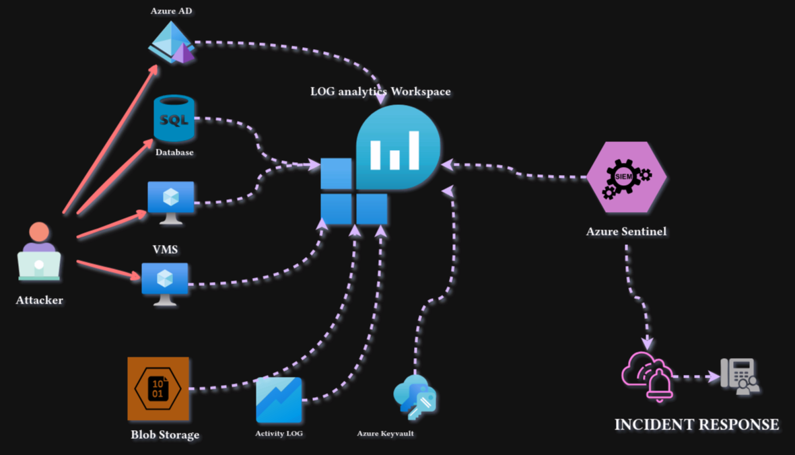
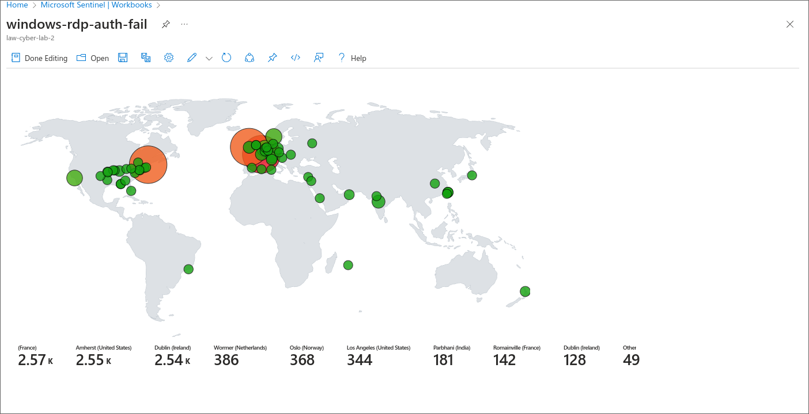
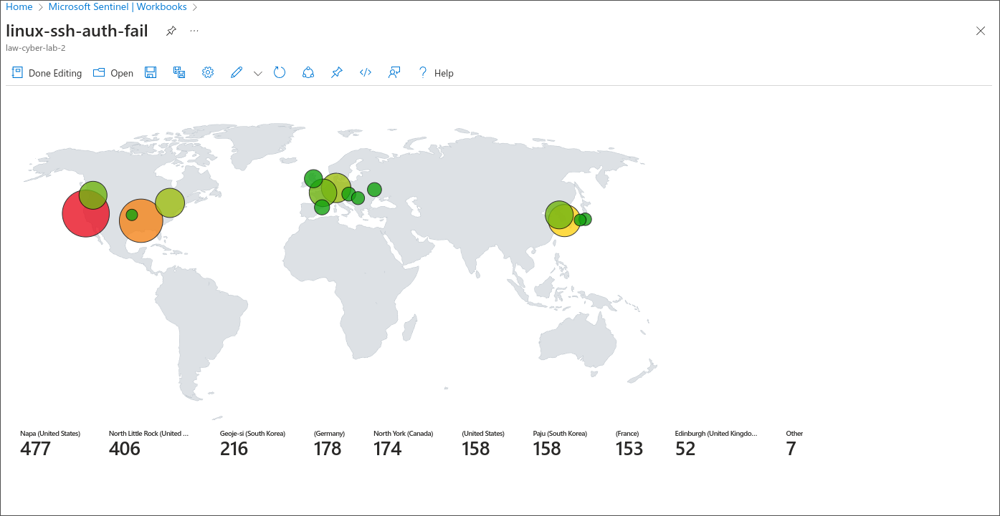
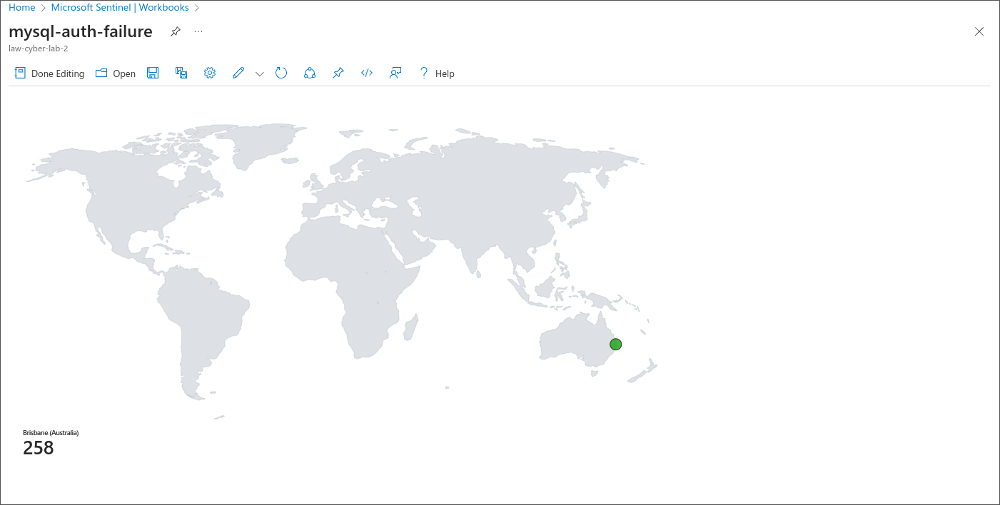
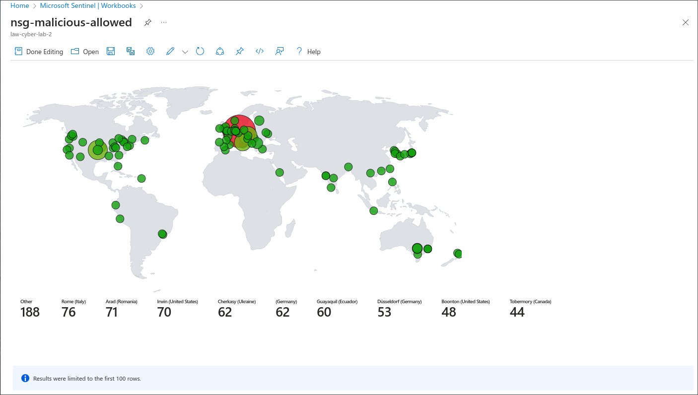

# Azure SOC Honeynet project

This is a project showcasing how I deployed a Honeynet on Azure and exposed it to the internet to generate incidents. Then I responded to those incidents and properly hardened the network according to the NIST 800-61 framework.

## Intro

Above is a visual representation of what the architecture looks like. It consists of a couple of VMS, a SQL database, Azure AD, blob storage and keyvault. This was all opened up to the public internet to simulate how real attackers attempt to break in and exfiltrate data from insecure machines. Below you'll see the amount of traffic and brute force attempts made on the insecure resources and then you'll see the results after they were properly hardened in accordance to NIST 800-53.

## List of Azure resources used 

- Azure Virtual Network
- Azure Network Security Group
- Log Analytics Workspace
- Azure Key Vault
- Azure Storage Account
- Microsoft Sentinel
- Microsoft Defender For Cloud
- NIST SP 800-53 Revision 
- NIST SP 800-61 

## How it was built

First, I created the Virtual machines and left their firewalls and NSGs wide open for the internet. This allowed me to establish a baseline.

Then I created a log Analytics Workspace to ingest all the logs from the open resources so they can be queried and observed within sentinel.

Afterward, I let the insecure environment run for over 24 hours, observing how often an open box on the internet will be scanned and possibly broken into. I was hoping to have one of my machines to have a successful brute force, so I can absorb the tactics and technique of an attacker, but I wasn't so lucky.

Finally, the environment was properly hardened and all resources could only be accessed by private end points and specified IP addresses. Below You'll see before and after of the number of events and also attack maps for specific resources. 

The events that were tracked as shown below were:

- Windows RDP brute force attempt
- Linux SSH brute force attempt
- SQL database brute force attempt
- Microsoft Sentinel number of incidents
- Malware introduced into our machines

## Insecure environment metrics

Table of the metrics measured in our insecure environment for 24 hours:
 
`Start Time:` 2024-07-10T23:11:49  
`Stop Time:` 2024-07-11T23:11:49

| Metric                   | Count
| ------------------------ | -----
| SecurityEvent            | 84064
| Syslog                   | 4889
| SecurityAlert            | 8
| SecurityIncident         | 282
| AzureNetworkAnalytics_CL | 1328

## Metrics After proper security controls

Table after applying security controls:
 
`Start Time:` 2024-07-14T11:15:46. 
`Stop Time:`	2024-05-15T11:15:46.

| Metric                   | Count
| ------------------------ | -----
| SecurityEvent            | 9169
| Syslog                   | 1
| SecurityAlert            | 0
| SecurityIncident         | 0
| AzureNetworkAnalytics_CL | 0

## Changes after Securing Environment
| Metric                                          | Percent
| ----------------------------------------------- | -----
| Security Event (Windows VM)                     |  -89.09%
| Syslog (Linux VM)                               |  -99.98%
| Security Alert (Microsoft Defender for Cloud)   |  -100.00%
| Security Incident (Sentinel Incidents)          |  -100.00%
| NSG Inbound Malicious Flows Allowed             |  -100.00%

## Attack maps 

After properly securing the environment attack maps didn't yield any results so only the before images are available.

*Windows RDP brute force attempts*

*Linux SSH brute force attempts*

*MYSQL brute force attempts*

*Malware introduced into machines*

## Conclusion

This was an educational project that made me respect even more the incident responders and how they have to sift through log after log and verify whether an incident is legitimate or not. It was also pretty fun, but like I noted before, I hoped an attacker would have gotten in, so their techniques could have been observed. It also shows how just hardening your system a little bit can have dramatic results, as in only allowing specific users or IPs to access certain resources. This might seem obvious, but many companies don't implement controls like these.
